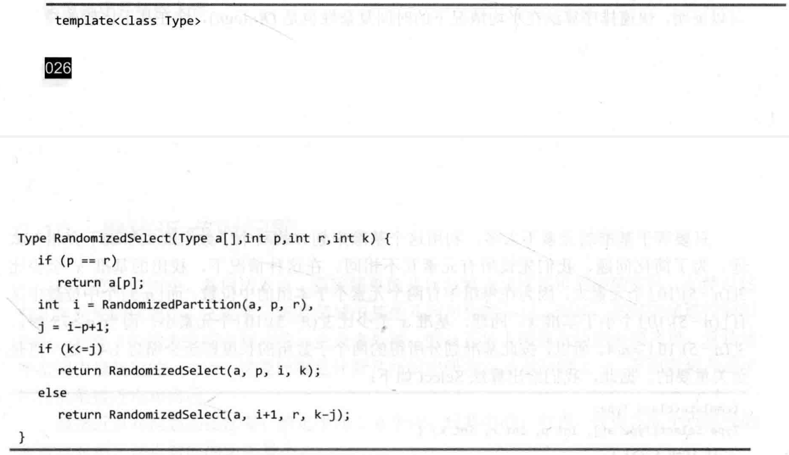

# 第二章-分治法

## 快速排序

```c++
void quickSort1(int a[], int l, int r)
{
	if (l >= r)
	{
		return;	
	} 
	int j = partition(a,l,r);
	quickSort1(a, l, j - 1);
	quickSort1(a, j + 1, r);
}

int partition(int a[],int l,int r)
{
	int i = l;
	int j = r+1;
	int x = a[l];
	while(1)
	{
		while(a[++i]<x && i<r);
		while(a[--j]>x);
		if(i>=j) break;
		int temp = a[i];
		a[i] = a[j];
		a[j] = temp;
	}
	
	a[l] = a[j];
	a[j] = x;
	return j;
}

int partitionRandom(int a[],int l,int r)
{
	int index = l+rand()%(r-l+1);
	int temp = a[l];
	a[l] = a[index];
	a[index] = temp;
	int i = l;
	int j = r+1;
	int x = a[l];
	while(1)
	{
		while(a[++i]<x && i<r);
		while(a[--j]>x);
		if(i>=j) break;
		temp = a[i];
		a[i] = a[j];
		a[j] = temp;
	}
	
	a[l] = a[j];
	a[j] = x;
	return j;
}
```

## 合并排序
### 递归

```c++
void mergeSortR(int a[], int l, int r)//int level)
{
	if (l >= r)
	{
		return;
	} 
	int mid = (l + r) >> 1;
   	mergeSortR(a,l,mid);
    mergeSortR(a,mid+1,r);
	mergeWithCopy(a, temp, l, r, mid);
}

void mergeWithCopy(int a[], int temp[], int l, int r, int mid)
{
	int i, j, k;
	i = l;
	j = mid + 1;
	k = l;
	while (i <= mid && j <= r)
	{
		if (a[i] < a[j]) temp[k++] = a[i++];
		else temp[k++] = a[j++];
	}
	while (i <= mid)
	{
		temp[k++] = a[i++];
	}
	while (j <= r)
	{
		temp[k++] = a[j++];
	}

	for (int i = l, j = l; i <= r; ++i, ++j)
	{
		a[i] = temp[j];
	}
}
```

### 非递归


## 线性时间选择



## 平面最近点对

### 一维的情况


### 二维的情况


# 第三章-动态规划

## 注意

- 代码10分（最优解5分，最优解构造5分），分析算法的**复杂度**分析5分，**递推式式子**5分等等都要算分。
- 判断最优子结构性质
- 状态转移方程
  - 边界条件
  - 其他情况

- 最优解是什么(值 和 串到底是什么)
- 代码

## 最优子结构性质


## 重叠子问题性质


## 矩阵连乘

## 最长公共子序列


==第一行应该是i等于0或者j等于0==


## 凸多边形三角剖分


应该是$k < j$


# 第四章-贪心

## 活动安排问题


## 最短路

### 贪心选择性质


### 最优子结构性质


### 代码

```c++
void dij()
{
	//全部内置为无穷大
	for(int i=0;i<col.size();++i)
	{
		dist[col[i]] = INF;
	}
	
	for(int i=0;i<col.size();++i)
	{
		pre[col[i]] = -1;//前置为0
	}
	
	for(int i=0;i<col.size();++i)
	{
		st[col[i]] = 0;
	}
	
	dist[567443] = 0;
	
	for(int i=1;i<=col.size()-1;++i)
	{
		int t = -1;
		for(auto ele : dist)
		{
			int nodenum = ele.first;
			double nowDist = ele.second;
			if(st[nodenum]==0 && (t==-1 || nowDist<dist[t]))
			{
				t = nodenum;
			}
		}
		
		st[t] = 1;//已经找过了
		cout<<t<<" "<<dist[t]<<'\n';
		for(auto ele: dist)
		{
			int nodenum = ele.first;
			double nowDist = ele.second;
			//dist[nodenum] = min(dist[nodenum],dist[t]+dis[t][nodenum]); //当不需要求路径的时候
			if(dist[nodenum]>dist[t]+dis[t][nodenum])
			{
				dist[nodenum]  = dist[t]+dis[t][nodenum];
				pre[nodenum] = t;
			}
		}
	}
}

void getPath(int nodeNum)
{
	if(pre[nodeNum]==-1)
	{
		cout<<nodeNum<<" ";
		return;
	} 
	getPath(pre[nodeNum]);
	cout<<nodeNum<<" ";
}

```

## 最小生成树

### MST


# 第五章-回溯法

## 子集树


时间复杂度$O(2^n)$

## 排列树


时间复杂度$O(n!)$

